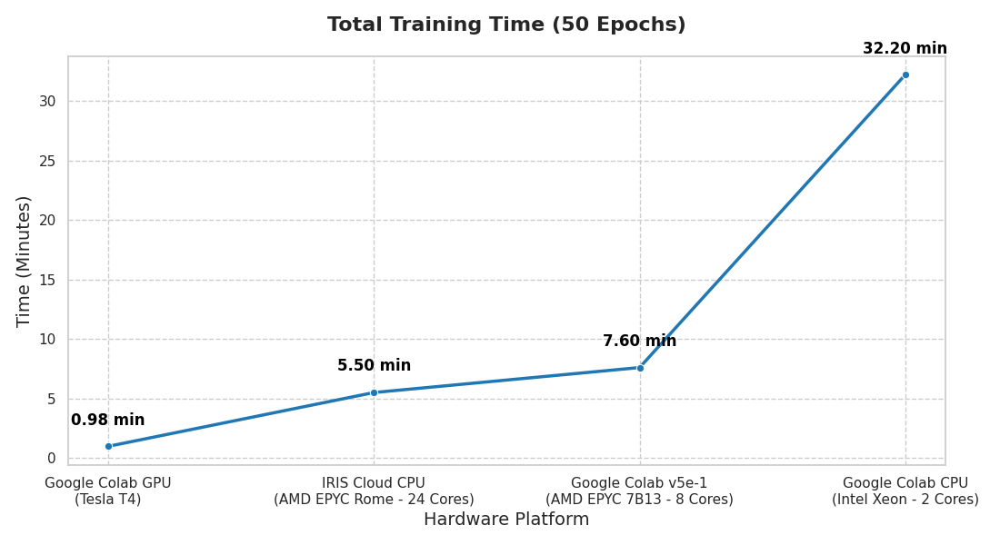
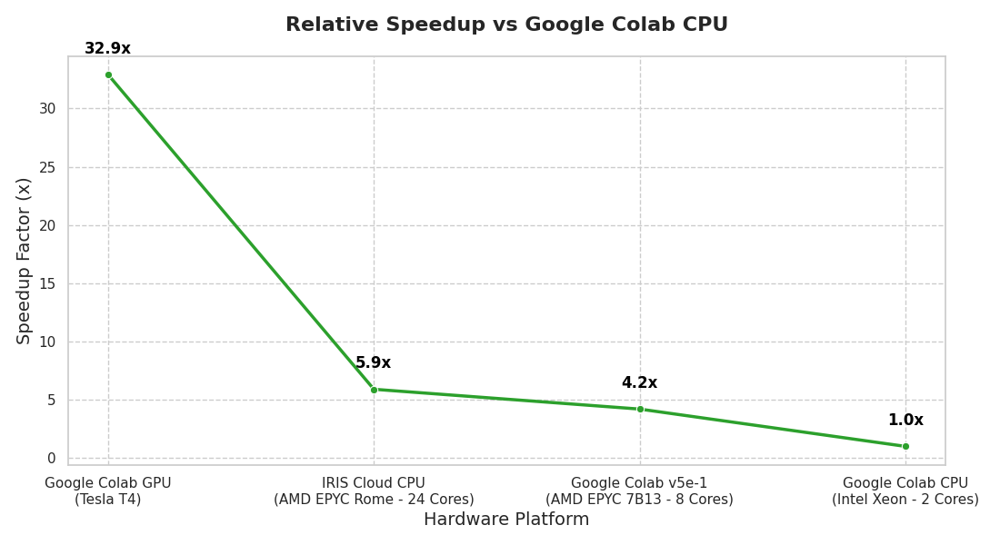

# AI/Ml Training Notebooks Benchmarking Report

## 1. Summary
This report benchmarks the DiRAC AI/Ml [notebooks](https://github.com/DiRAC-HPC/ML-Intro) across several hardware configurations. The goal was to evaluate the impact of hardware acceleration on training time.

## 2. Data

The following table summarizes the performance metrics for [Galaxy Classification](https://github.com/DiRAC-HPC/ML-Intro/blob/main/notebooks_with_solutions/Astronomy_Galaxy%20Classification%20(CNN)_solution.ipynb) CNN example, 50 epochs of training.

| Hardware Platform | Processor / Accelerator | Time per Epoch | Total Training Time | Relative Speedup |
| :--- | :--- | :--- | :--- | :--- |
| **Google Colab GPU** | Tesla T4  | ~1.2 s | 0.98 min | 32.9x Faster |
| **IRIS Cloud CPU** | AMD EPYC Rome (24 Cores) | ~6.5 s | 5.50 min | 5.9x Faster |
| **Google Colab v5e-1** | AMD EPYC 7B13 (8 Cores) | ~9.2 s | 7.60 min | 4.2x Faster |
| **Google Colab CPU** | Intel Xeon @ 2.2GHz (2 Cores) | ~38.6 s | 32.20 min | **1.0x (Baseline)** |

## 3. Results

