# Moodle + JupyterHub Integration
## Progress Report — March 2026

> **Platform:** Azimuth / COSMA Durham &nbsp;|&nbsp; **Cluster:** ml-intro (Kubernetes) &nbsp;|&nbsp; **Status:** ⏳ 1 External Blocker Remaining

---

## Table of Contents

1. [Objective](#1-objective)
2. [Infrastructure Overview](#2-infrastructure-overview)
3. [Access Levels](#3-access-levels)
4. [SSO Authentication Flow](#4-sso-authentication-flow)
5. [Student Experience — End Goal](#5-student-experience--end-goal)
6. [What Was Achieved](#6-what-was-achieved)
7. [Attempts & Dead Ends](#7-attempts--dead-ends)
8. [The Single Remaining Blocker](#8-the-single-remaining-blocker)
9. [Next Steps & Roadmap](#9-next-steps--roadmap)
10. [Full Status Board](#10-full-status-board)

---

## 1. Objective

> **The Goal:** Allow students to open and run Jupyter notebooks **directly inside Moodle** — using a single university login, with no separate passwords or manual steps.

Currently students must visit JupyterHub separately and log in independently from Moodle. The target experience is:

```
Student clicks activity in Moodle  →  Notebook opens embedded  →  Already logged in
```

No separate tab. No second password. One click.

---

## 2. Infrastructure Overview

Three systems must work together. Understanding who controls what explains the current situation.

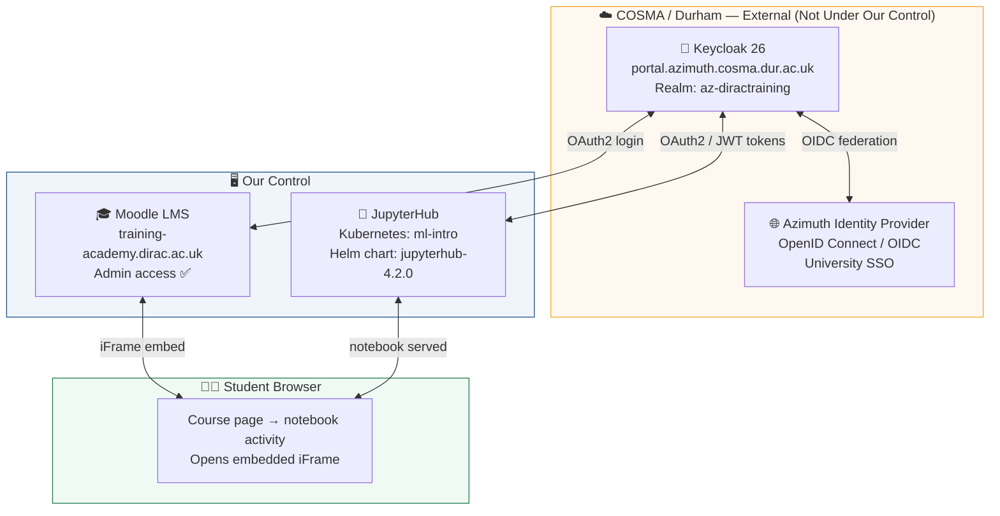

### Who Controls What

| System | Controller | Access Level |
|---|---|---|
| **Keycloak 26** | COSMA / Durham | ❌ No server access |
| **Azimuth Identity Provider** | COSMA / Durham | ❌ No server access |
| **JupyterHub (ml-intro)** | Us | ✅ Full kubectl access |
| **Moodle LMS** | Us | ✅ Full admin panel |
| **Kubernetes cluster** | Us | ✅ Full kubectl access |
| **Keycloak admin panel** | Us | ✅ Full admin (realm only) |

---

## 3. Access Levels

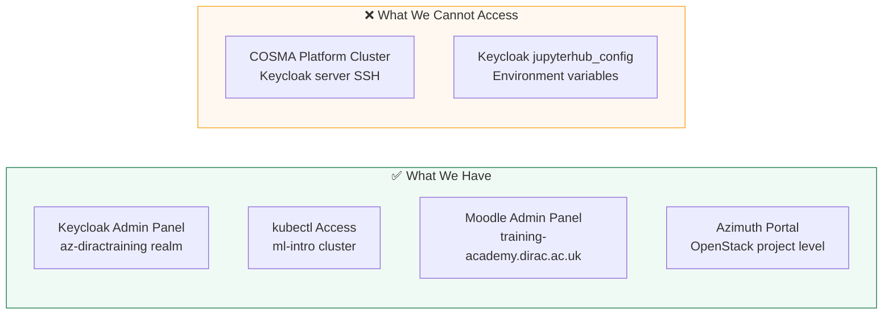

---

## 4. SSO Authentication Flow

This is the complete chain that runs when a student clicks a notebook activity in Moodle.

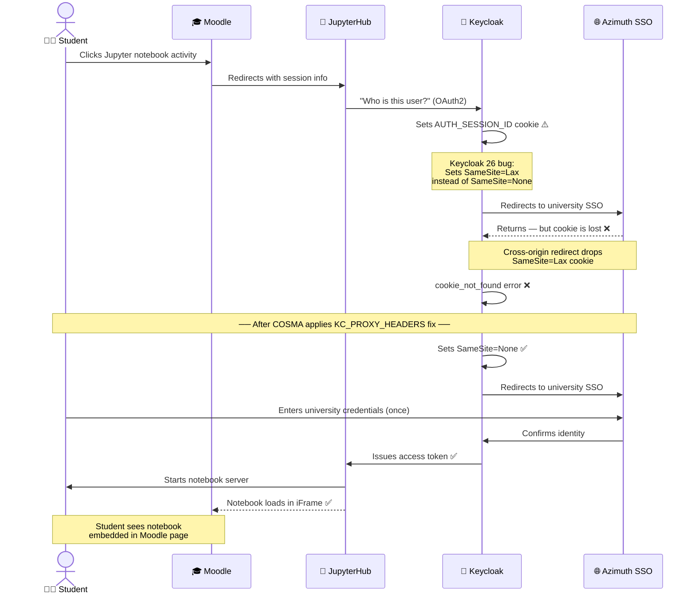

### Simplified Flow Diagram

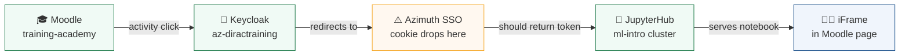

### Cookie Problem Explained Simply

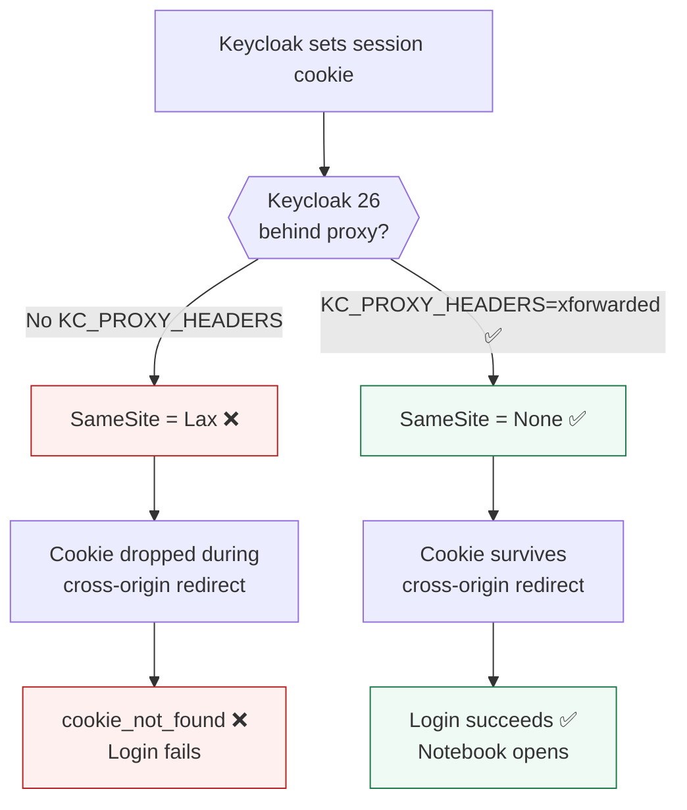

---

## 5. Student Experience — End Goal

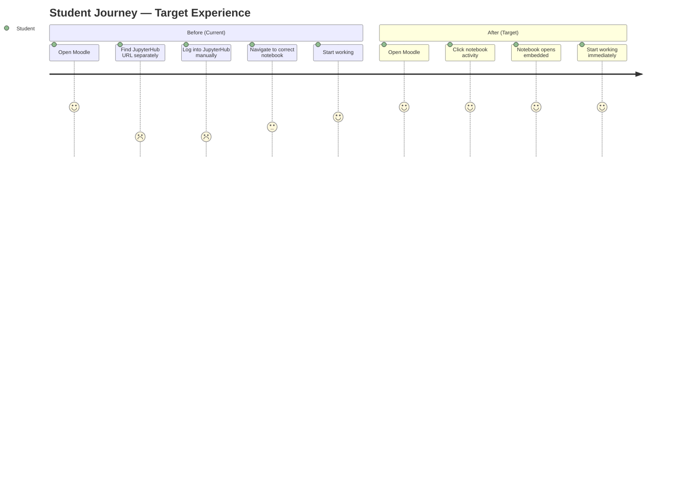

---

## 6. What Was Achieved

### Summary

| | Count |
|---|---|
| ✅ Tasks completed | **5** |
| ⚠️ External blockers | **1** |
| ⬜ Next steps queued | **4** |

### Completed Work

#### ✅ 1. Root Cause Identified

Diagnosed the exact error causing login failure by inspecting Keycloak Events:

```
Event:              IDENTITY_PROVIDER_LOGIN_ERROR
identity_provider:  azimuth
error:              cookie_not_found
```

Traced to **Keycloak 26** changing `SameSite=None` → `SameSite=Lax` on session cookies when running behind a reverse proxy without the `KC_PROXY_HEADERS` configuration.

#### ✅ 2. Keycloak Clients Verified

Both required clients confirmed as already existing and working in the `az-diractraining` realm:

| Client | Status | Evidence |
|---|---|---|
| `moodle-lms` | ✅ Working | `LOGIN` events in Keycloak |
| `kubeapp-ml-intro.ml-intro-jupyterhub-azimuth` | ✅ Working | `CODE_TO_TOKEN` events confirmed |

#### ✅ 3. JupyterHub iFrame Header Applied

Using `kubectl` access to the ml-intro Kubernetes cluster, patched the JupyterHub configmap to allow Moodle to embed JupyterHub in an iFrame:

```python
# Added to jupyterhub_config.py in Kubernetes configmap
c.JupyterHub.tornado_settings = {
    "slow_spawn_timeout": 0,
    "headers": {
        "Content-Security-Policy": "frame-ancestors 'self' https://training-academy.dirac.ac.uk",
    },
}
```

Deployed with:
```bash
kubectl rollout restart deployment/hub -n ml-intro
# Result: deployment "hub" successfully rolled out ✅
```

#### ✅ 4. Keycloak Security Headers Verified

Confirmed `Realm Settings → Security Defenses → Headers` already correctly set:

```
X-Frame-Options:         ALLOW-FROM https://training-academy.dirac.ac.uk
Content-Security-Policy: frame-src 'self'; object-src 'none';
                         frame-ancestors 'self' https://training-academy.dirac.ac.uk
```

No changes needed on the Keycloak side for this.

#### ✅ 5. kubectl Cluster Access Established

Full programmatic access to ml-intro Kubernetes cluster confirmed:

```
NAME                            STATUS   ROLES           VERSION
ml-intro-control-plane-4ng86   Ready    control-plane   v1.34.4
ml-intro-control-plane-j2vrb   Ready    control-plane   v1.34.4
ml-intro-control-plane-pd7lj   Ready    control-plane   v1.34.4
ml-intro-ml-intro-xcwt5-49b8r  Ready    worker          v1.34.4
```

---

## 7. Attempts & Dead Ends

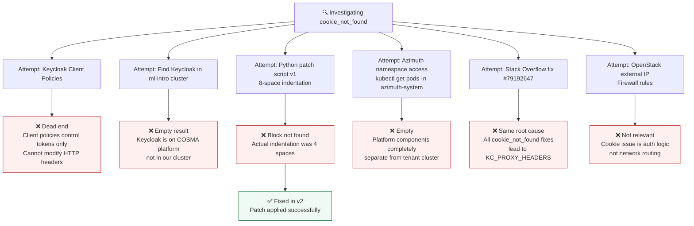

---

## 8. The Single Remaining Blocker

> ⚠️ **Everything on our side is complete.** The only remaining blocker is one environment variable on COSMA's Keycloak server — a server we do not control.

### What Needs to Change

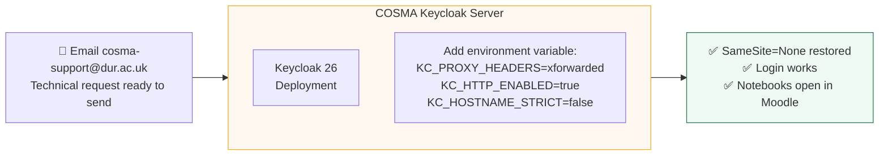

### The Fix in Detail

```bash
# One environment variable on COSMA's Keycloak Kubernetes deployment
KC_PROXY_HEADERS=xforwarded
KC_HTTP_ENABLED=true
KC_HOSTNAME_STRICT=false
```

This tells Keycloak to trust the `X-Forwarded-Proto: https` header from the Kubernetes ingress, which restores the correct `SameSite=None; Secure` cookie behaviour.

**Time to apply:** ~5 minutes
**Risk:** Very low — only affects cookie flag, not authentication logic
**Affects other users:** No

**Action:** Email `cosma-support@dur.ac.uk` — technical request already drafted and ready to send.

---

## 9. Next Steps & Roadmap

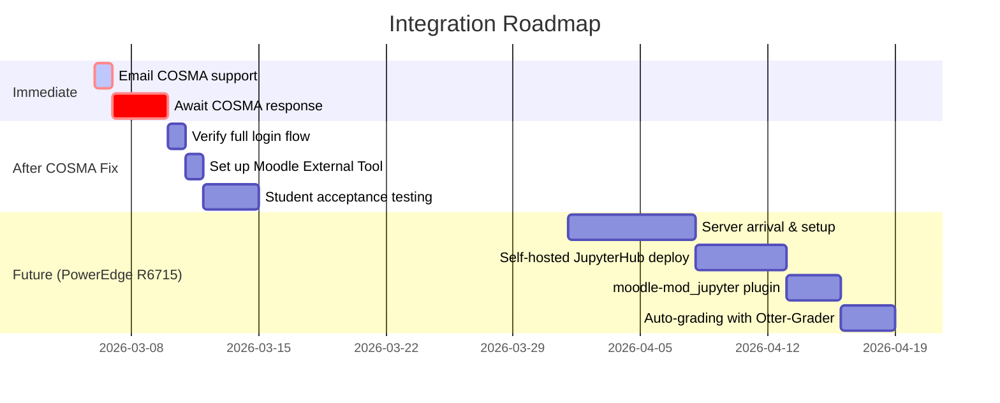

### Step-by-Step Actions

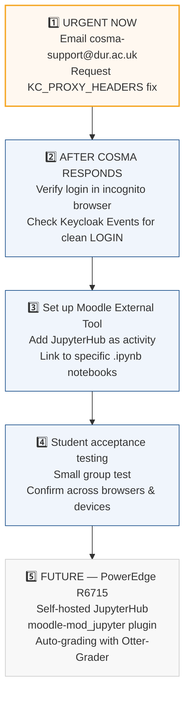

---

## 10. Full Status Board

```mermaid
flowchart LR
    subgraph done["✅ DONE"]
        D1["Root cause identified\ncookie_not_found = Keycloak 26 bug"]
        D2["Keycloak clients confirmed\nmoodle-lms + jupyterhub exist"]
        D3["JupyterHub CSP header applied\nframe-ancestors set & deployed"]
        D4["Keycloak CSP headers verified\ntraining-academy.dirac.ac.uk allowed"]
        D5["kubectl access established\nml-intro cluster, all 4 nodes healthy"]
    end

    subgraph waiting["⏳ WAITING"]
        W1["COSMA: KC_PROXY_HEADERS\nEmail ready to send"]
    end

    subgraph todo["⬜ NEXT"]
        T1["Verify full login flow"]
        T2["Moodle External Tool setup"]
        T3["Student testing"]
        T4["PowerEdge R6715 deployment"]
    end

    done --> waiting --> todo

    style done fill:#f0faf5,stroke:#1e7a4a
    style waiting fill:#fff8f0,stroke:#f5a623
    style todo fill:#f8f8f8,stroke:#ccc
```

---

## Appendix — Files Produced

| File | Purpose |
|---|---|
| `JupyterHub_Moodle_Guide.md` | General integration overview |
| `Jupyter_Notebooks_Inside_Moodle_Complete_Guide.md` | All 4 plugin options |
| `Moodle_Azimuth_JupyterHub_Integration_Guide.md` | Azimuth-specific guide |
| `Moodle_Azimuth_Simple_Access_Guide.md` | LTI External Tool setup |
| `Moodle_JupyterHub_Keycloak_Full_Integration.md` | Full Keycloak OIDC wiring |
| `Current_State_Integration_Plan.md` | Realistic plan for current access |
| `Keycloak26_SameSite_Cookie_Fix.md` | KC_PROXY_HEADERS fix guide |
| `Fix_cookie_not_found_Keycloak26.md` | Exact fix for confirmed error |
| `Apply_KC_PROXY_HEADERS_Fix.md` | kubectl step-by-step guide |
| `Kubernetes_Step_By_Step_Fix.md` | kubectl setup from scratch |
| `patch_jupyterhub_csp.py` | Python script — patched JupyterHub configmap |
| `Moodle_JupyterHub_Progress_Report.html` | Visual HTML report for PIs |
| `Progress_Report_March_2026.md` | Full technical progress report |

---

*Report prepared: March 6, 2026 &nbsp;|&nbsp; Realm: az-diractraining &nbsp;|&nbsp; Cluster: ml-intro &nbsp;|&nbsp; COSMA Durham*
