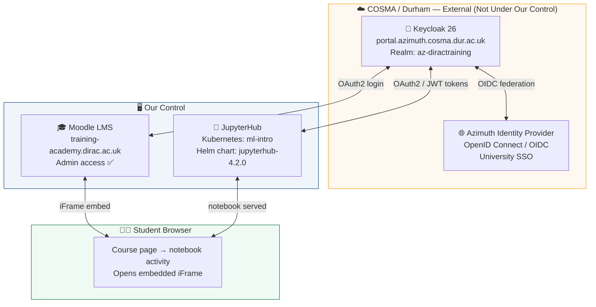

# Moodle + JupyterHub Integration
## Progress Report — 4-6 March 2026

> **Platform:** Azimuth &nbsp;|&nbsp; **Cluster:** ml-intro (Kubernetes) &nbsp;|&nbsp;

---

## Table of Contents

1. [Objective](#1-objective)
2. [Architecture Overview](#2-Architecture-overview)

---

## 1. Objective

> **The Goal:** Allow users to open and run Jupyter notebooks **directly inside Moodle** 

Currently students must visit JupyterHub separately and log in independently from Moodle. The target experience is:

```
Student clicks activity in Moodle  →  Notebook opens embedded  →  Already logged in
```


---

## 2. Architecture Overview

Azimuth, Keycloak and Moodle must work together. Understanding who controls what explains the current situation of the architecture.



*Report prepared: March 6, 2026 &nbsp;*

